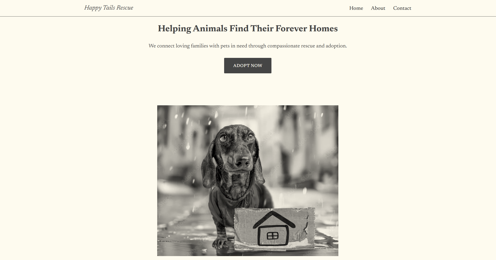

# Portfolio Website – Jane Chavez

This repository contains the source code for my personal portfolio website, built to showcase my work as a **Frontend Developer with a strong focus on UI/UX and user-centered design**.

## Overview

This portfolio demonstrates my ability to build **responsive, accessible, and visually polished web interfaces** using modern frontend technologies. It highlights selected projects, technical skills, and my approach to combining design thinking with practical implementation.

## Live Site

https://jpdm07.github.io/portfolio-website/

---

## Key Features

- Fully responsive, mobile-first layout  
- Clean and maintainable HTML/CSS structure  
- Interactive UI elements using JavaScript  
- Consistent spacing, typography, and layout system  
- Project case study format (Problem → Role → Process → Outcome)  
- Accessibility-aware development using semantic HTML  

---

## Tech Stack

- HTML5  
- CSS3 (Flexbox, Grid, responsive design)  
- JavaScript (ES6+)  
- Bootstrap 5  
- Git & GitHub  
- Figma (for UI planning and prototyping)  

---

## Purpose

This project was built to:

- Showcase my frontend development skills through real projects  
- Demonstrate my ability to translate UI/UX concepts into working interfaces  
- Present clean, maintainable, and scalable code structure  
- Provide a clear and professional portfolio for recruiters and hiring managers  

---

## Preview

### Portfolio Homepage

### CaloriEat (live demo opens [welcome](https://jpdm07.github.io/CaloriEat/welcome.html))

### Animal Rescue Redesign

---

## Resume

My latest resume is included in this repository:  
Jane_Chavez_Resume_2026.pdf

---

## Currently Learning

- React (component-based architecture and state management)  
- Improving frontend scalability and code organization  

---

Designed and built by Jane Chavez