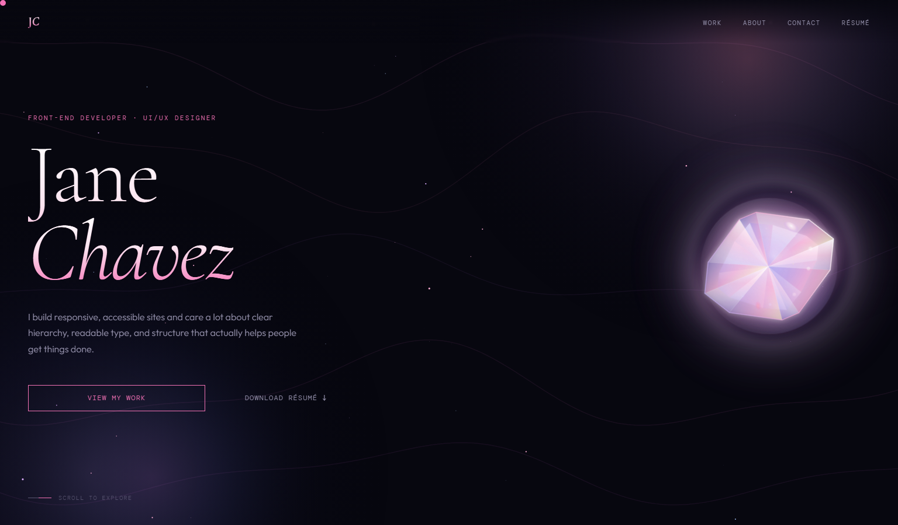
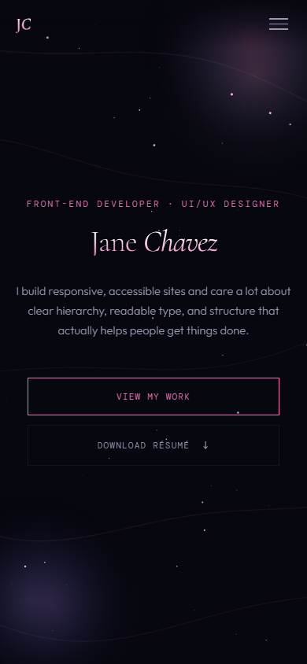
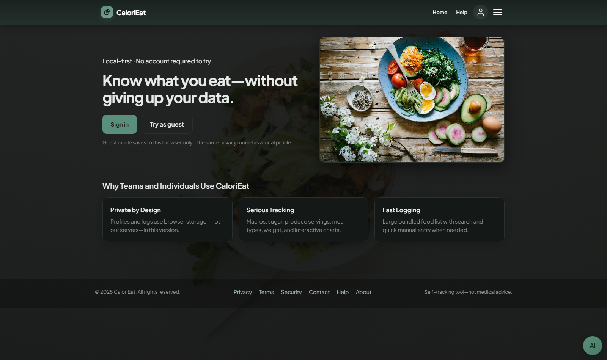
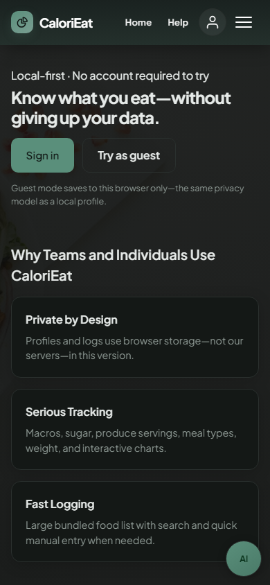
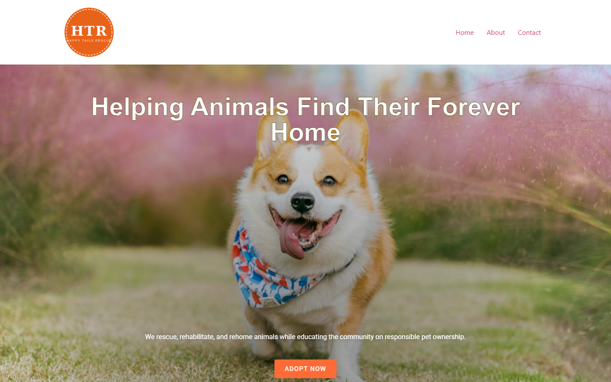
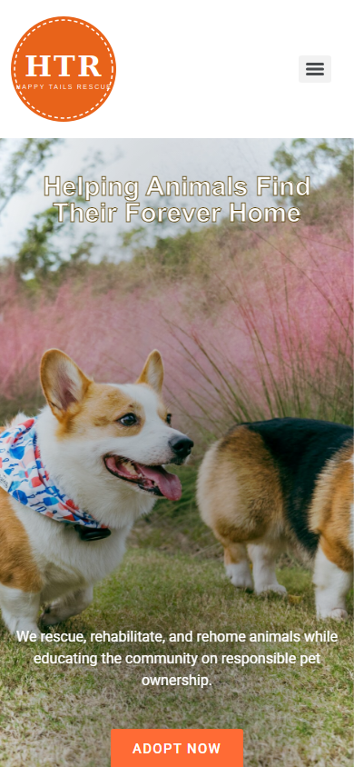
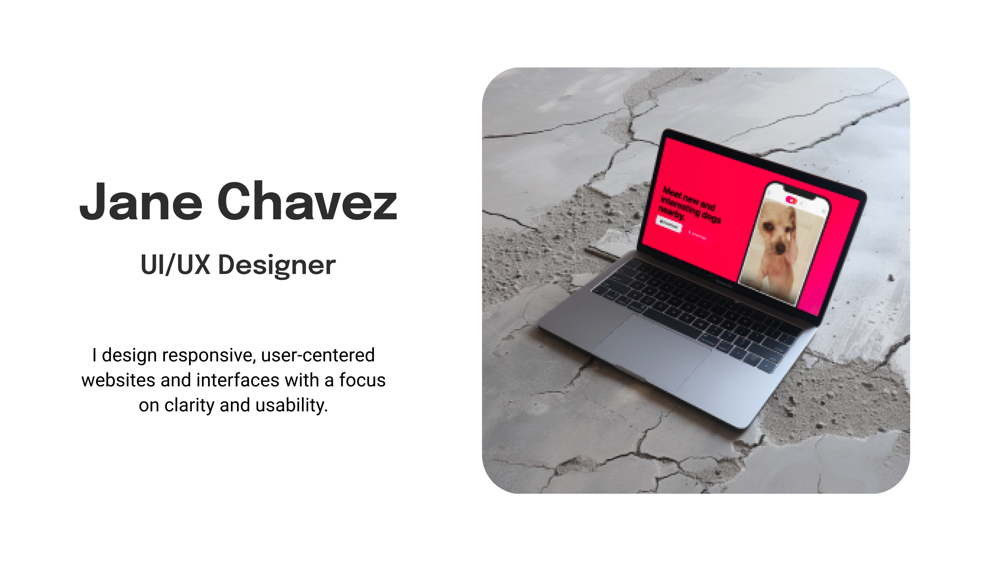

# Jane Chavez — Portfolio

**Front-end developer · UI/UX designer** · M.S. Software Engineering, University of Houston–Clear Lake (Dec 2025) · Cypress, TX  

Hand-coded portfolio on **GitHub Pages**: responsive layout, custom CSS and motion, and a clear story for each project—so recruiters see both **how it looks** and **how it’s built**.

**Live portfolio:** https://jpdm07.github.io/portfolio-website/

**Quick links:** [Résumé (web)](https://jpdm07.github.io/portfolio-website/resume.html) · [PDF résumé](./Jane_Chavez_Resume_2026.pdf)

---

## What this repo is

A static site (HTML, CSS, JavaScript) that showcases selected work: a capstone app, WordPress nonprofit build, volunteer UX case study, Figma UI, and course-based demos. No React on this site—it's intentional, to show I can ship polished UI without a framework.

---

## Highlights

| Area | What you’ll find |
|------|------------------|
| **Layout & UI** | Responsive grid/flex, typography scale, project accordions, device-style mockups |
| **Motion & polish** | Canvas background, scroll reveals, hero interaction, careful mobile nav |
| **Content** | Problem → role → outcome for each project; links to live demos and source |
| **Accessibility** | Semantic HTML, keyboard-friendly patterns, reduced-motion awareness where applied |

---

## Tech & tools

- **This site:** HTML5, CSS3 (Flexbox, Grid, custom properties), JavaScript (ES6+), Git, GitHub Pages  
- **Design:** Figma (wireframes and UI)  
- **Elsewhere in my work:** WordPress.org + Elementor, Chart.js, Bootstrap (Udemy / WoofDog demo), Node.js (team capstone)

---

## Screenshots

Each project below includes a **live demo** link where there is one. The images are previews only.

### This portfolio (current build)

**Live demo:** https://jpdm07.github.io/portfolio-website/ — same site as this README’s repo (GitHub Pages).

| Desktop | Mobile |
|:-------:|:------:|
|  |  |
| *Hero, crystal, and project grid* | *Narrow viewport* |

---

### CaloriEat — calorie tracking (capstone team project)

**Live demos** (same app after merge; sign-in or try as guest):

- **My fork (GitHub Pages):** https://jpdm07.github.io/CaloriEat/welcome.html  
- **Team repo (GitHub Pages):** https://mchavez31.github.io/CaloriEat/welcome.html  

**Repos:** [My fork](https://github.com/jpdm07/CaloriEat) (working copy + my Pages deploy) · [Team / canonical](https://github.com/Mchavez31/CaloriEat) (capstone repo; **post-grad work merged here April 2026**)

**Workflow:** Post-capstone improvements shipped via **pull request** into the team repo, reviewed and merged. Future changes follow the same fork → PR path. **[Compare fork → team `main` (open a PR)](https://github.com/Mchavez31/CaloriEat/compare/main...jpdm07:CaloriEat:main?expand=1)**

| Desktop | Mobile |
|:-------:|:------:|
|  |  |

---

### Happy Tails Rescue — WordPress nonprofit site

**Live demo:** https://janechavez.org  

WordPress.org + Elementor, custom branding and SureForms contact flow. UX direction informed by volunteer work with **Sierra Overlook Animal Rescue**; Wix optimization is documented in the **[SOAR case study](https://jpdm07.github.io/portfolio-website/soar-case-study.html)** (opens on this portfolio site).

| Desktop (current site) | Mobile |
|:----------------------:|:------:|
|  |  |

---

### Figma — hero exploration

**Live design / prototype:** [Figma — Hero Section (prototype)](https://www.figma.com/proto/qhk0PTd7kBe39rhb9lrMKr/Hero-Section?node-id=0-1&t=eog5D9QeQcq6Pt3I-1)

| Design export |
|:-------------:|
|  |
| *High-fidelity hero treatment* |

---

## Résumé

- **PDF:** [Jane_Chavez_Resume_2026.pdf](./Jane_Chavez_Resume_2026.pdf)  
- **Web:** [Résumé page](https://jpdm07.github.io/portfolio-website/resume.html) (same content structure; PDF is the primary download for ATS and email)

---

## Currently learning

- **React** — components, state, and patterns for scalable UIs  
- **Production-minded front-end** — structure, performance, and maintainability on real projects  
- **Full-stack depth (Udemy, in progress)** — Node, APIs, and deployment topics to complement client-side work and capstone-style teamwork  

---

## Connect

- **GitHub:** [github.com/jpdm07](https://github.com/jpdm07)  
- **LinkedIn:** [linkedin.com/in/jane-c-699a9241](https://www.linkedin.com/in/jane-c-699a9241)  

---

*Designed and built by Jane Chavez.*
